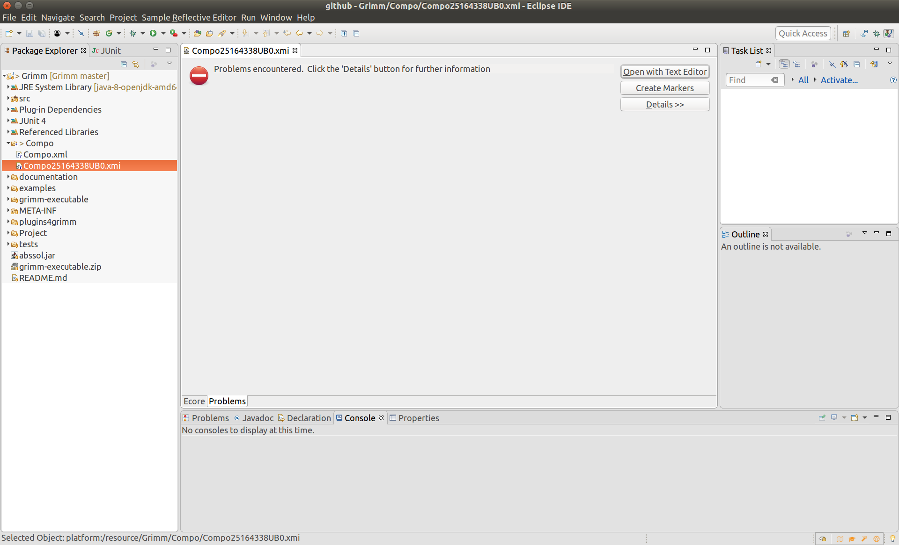
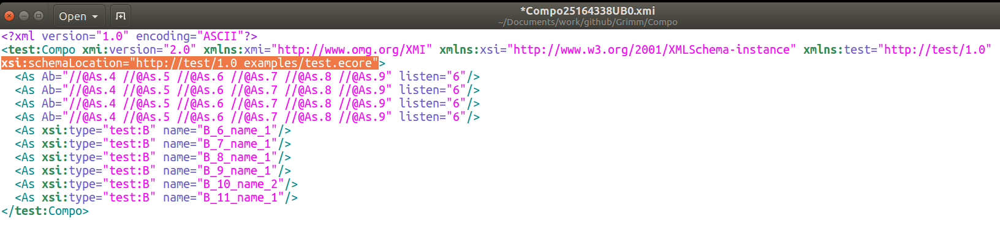
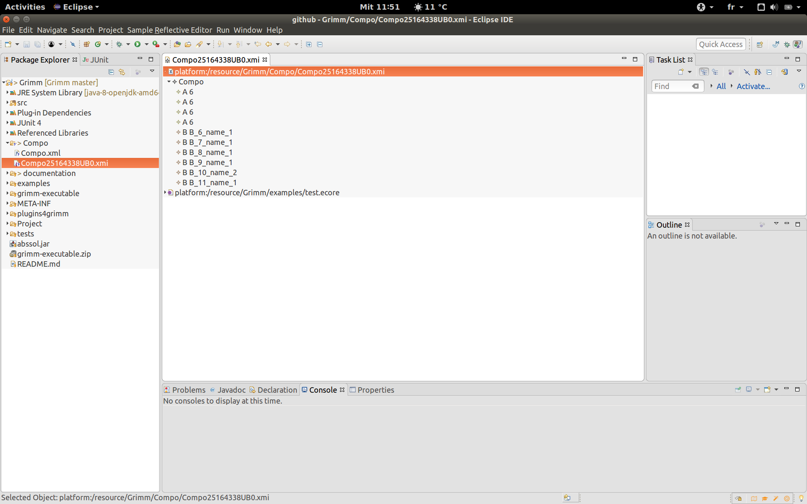

# How to open xmi files with Sample Reflective Ecore Model Editor

The models that are generated by [Grimm](https://github.com/ferdjoukh/grimm) tool are conform to the xmi format. So, they can be opened with the Sample Reflective Ecore Model Editor in Eclipse.

This editor is very useful because it allows to perform many operations on xmi models. For examples, creating, modifying or removing model elements.

Here we explain you what to do when you face a problem while opening an xmi file in Eclipse.

## Why can't I open my xmi file ?

The problem is that Eclipse is incapable to localize the Ecore meta-model to use in order to open you xmi file. This frequently happens when the Ecore meta-model and the xmi files are not in the same folder.

## Solution

1. Open your xmi file in a text editor
2. Modify the **xsi**:*schemaLocation* attribute of the xmi file

3. In my case, grimm generated the following value:

	`http://test/1.0 examples/test.ecore`

My xmi file is in folder ./Compo/ and the .ecore file is in folder ./examples/

4. I will put the following value to the **xsi**:*schemaLocation* attribute:

	`http://test/1.0 ../examples/test.ecore`

5. Try to open the xmi file with Sample Reflective Ecore Model Editor

